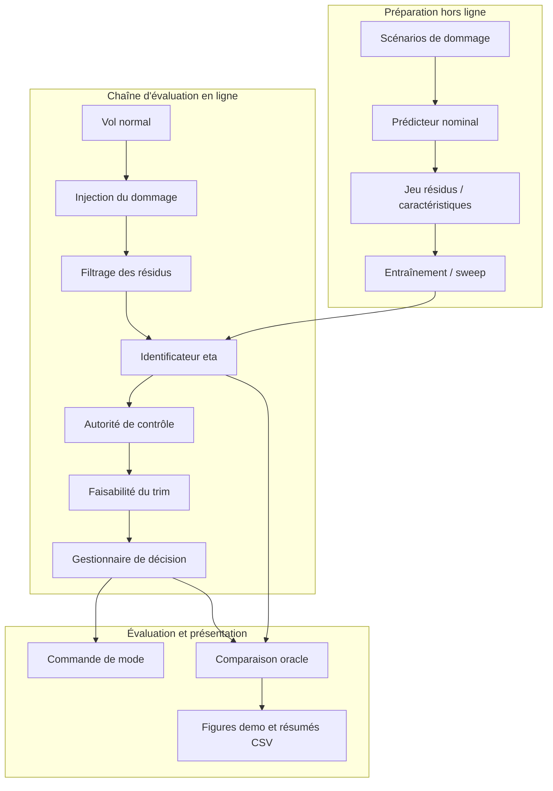

# Système d'identification en ligne et de décision pour avion endommagé ✈️🔥🛠️

<p align="right">
  <a href="./README.md">English</a> | 
  <a href="./README.zh-CN.md">简体中文</a> | 
  <a href="./README.fr.md">Français</a>
</p>

<p align="center">
  
  
  
</p>

> Un prototype MATLAB/Simulink qui répond à une question un peu dramatique, mais franchement utile :
>
> **"L'avion est endommagé. Peut-il encore voler correctement, et à quel point devons-nous paniquer ?"** 😅

## Résumé

Ce dépôt présente un prototype de recherche pour **l'identification en ligne des dommages, l'évaluation de la contrôlabilité, l'analyse de la faisabilité du trim et l'aide à la décision de mission** pour un avion à voilure fixe endommagé. Le projet relie scripts MATLAB, modèles Simulink, logique d'identification fondée sur les résidus et outils d'évaluation en boucle fermée dans un seul flux de travail.

En langage simple :  
l'avion souffre, le modèle essaie de rester digne, l'identificateur joue au détective, puis la logique de décision choisit entre rester calme, se stabiliser, rentrer, dérouter, ou avoir une conversation très sérieuse avec la gravité 🌶️

Le socle actuel du projet comprend :

- paramétrisation des dommages et cartographie vers les pertes aéro/commande
- prédiction nominale et génération de résidus capteurs
- identification basée sur des résidus filtrés
- évaluation de la contrôlabilité et du trim
- logique de décision protégée par un score de confiance
- benchmark, décomposition d'erreur, sensibilité et cohérence en boucle fermée
- interface prototype côté Simulink et support de visualisation

## Navigation Rapide

- [Vue d'ensemble du système](#2-vue-densemble-du-système)
- [Méthode](#5-méthode)
- [Données et artefacts](#6-données-et-artefacts)
- [Workflow recommandé](#8-workflow-recommandé)
- [Scripts clés](#9-scripts-clés)
- [Pour aller plus loin](#13-pour-aller-plus-loin)

---

## 1. Introduction

L'évaluation des dommages d'un aéronef est un problème classique du type : "tout allait bien, puis soudainement plus du tout" 💀  
Le but de ce projet est de relier quatre briques dans un prototype exécutable :

1. **représentation du dommage**
2. **identification en ligne**
3. **évaluation de l'autorité de contrôle**
4. **aide à la décision**

afin d'étudier toute la chaîne au même endroit, plutôt que de disperser la logique entre scripts, notes, captures d'écran et foi d'ingénieur.

---

## 2. Vue d'ensemble du système

### 2.1 Objectif fonctionnel

Le projet cherche à répondre à quatre questions :

- **Qu'est-ce qui est endommagé ?**
- **Quelle contrôlabilité reste-t-il ?**
- **L'avion peut-il encore trimmer et rester exploitable ?**
- **Que doit faire la logique de mission ensuite ?**

### 2.2 Pipeline de bout en bout



### 2.3 Résumé en une ligne

```text
dommage -> résidus -> caractéristiques -> identification -> contrôlabilité -> trim -> décision
```

C'est l'intrigue principale. Le reste, c'est du support, de l'analyse, ou MATLAB qui fait du MATLAB.

---

## 3. Contributions principales

### 3.1 P1 : noyau d'évaluation des dommages

- vecteur structuré de dommage `theta_d` de taille `12 x 1`
- cartographie des dommages structurels / actionneurs vers les effets aéro-contrôle
- métriques de contrôlabilité `eta_roll`, `eta_pitch`, `eta_yaw`, `eta_total`
- analyse de faisabilité du trim à base de règles
- première logique de décision de mission

### 3.2 P2 : prototype d'identification pilotée par les résidus

- génération de jeu de données d'identification
- entraînement et évaluation d'un identificateur de base
- comparaison en boucle fermée identified-vs-oracle

### 3.3 P3 / P3.5 : pipeline de recherche renforcé

- prédiction de réponse nominale
- filtrage des résidus
- ingénierie de caractéristiques plus riche
- configurations multi-modèles
- sorties de confiance et d'incertitude approximative
- analyse de robustesse de décision
- décomposition d'erreur et balayage d'hyperparamètres

### 3.4 P4-lite : couche de visualisation / présentation

- interface de visualisation dans le modèle
- export de figures de démonstration
- diagrammes d'architecture / de flux / de présentation
- export de captures du modèle pour rapports et slides

Version courte : le projet est passé de  
"est-ce qu'on peut estimer quelque chose ?" à  
"est-ce qu'on peut estimer quelque chose d'utile, l'expliquer proprement, et survivre à la séance de questions ?" 📊🙂

---

## 4. Représentation du dommage

L'état de dommage est représenté par un vecteur continu :

```text
theta_d in R^(12 x 1), avec chaque élément généralement dans [0, 1]
```

| Indice | Variable | Signification |
| --- | --- | --- |
| 1 | `left_inner_wing` | dommage structurel aile gauche interne |
| 2 | `left_outer_wing` | dommage structurel aile gauche externe |
| 3 | `right_inner_wing` | dommage structurel aile droite interne |
| 4 | `right_outer_wing` | dommage structurel aile droite externe |
| 5 | `left_horizontal_tail` | dommage profondeur gauche |
| 6 | `right_horizontal_tail` | dommage profondeur droite |
| 7 | `vertical_tail` | dommage dérive verticale |
| 8 | `left_aileron_eff` | perte d'efficacité aileron gauche |
| 9 | `right_aileron_eff` | perte d'efficacité aileron droit |
| 10 | `elevator_eff` | perte d'efficacité profondeur |
| 11 | `rudder_eff` | perte d'efficacité direction |
| 12 | `thrust_eff` | perte d'efficacité de poussée |

Ce vecteur est la source de tout le drame numérique du projet, ce qui a au moins l'avantage de garder le drame bien indexé.

---

## 5. Méthode

### 5.1 Prédiction nominale

Le projet utilise un prédicteur nominal simplifié pour estimer ce que l'avion **aurait dû faire** s'il était resté à peu près sain :

- `functions/predict_nominal_response.m`

Ce n'est pas un observateur optimal rigoureux.  
C'est plutôt l'équivalent de :

> "Cher avion, en conditions normales tu étais censé faire *ça*. Pourquoi fais-tu *autre chose* ?" 🤨

### 5.2 Génération et filtrage des résidus

Les résidus sont générés par :

- `functions/compute_sensor_residuals.m`

Le filtrage des résidus est géré par :

- `functions/filter_residual_sequence.m`

Les canaux résiduels actuels incluent :

- résidu de vitesse
- résidu de taux angulaire
- résidu d'attitude
- résidu d'accélération
- résidu de suivi de commande

### 5.3 Ingénierie de caractéristiques

Point d'entrée de construction des caractéristiques :

- `functions/build_identifier_features.m`

Modes représentatifs :

- `summary`
- `summary_plus_residual_energy`
- `summary_plus_cross_channel_stats`
- `normalized_summary`
- `residual_coupling_summary`
- `sequence`
- `hybrid_sequence_summary`
- `hybrid_sequence_summary_v2`

### 5.4 Identification

Fonctions principales d'entraînement et d'inférence :

- `functions/get_identifier_model_config.m`
- `functions/train_damage_identifier.m`
- `functions/run_damage_identifier.m`

Familles de modèles actuellement disponibles :

- `ridge`
- `shallow_mlp`
- `ensemble_summary`
- `sequence_placeholder`

La cible d'identification par défaut est généralement :

```text
eta_hat = [eta_roll_hat, eta_pitch_hat, eta_yaw_hat, eta_total_hat]
```

### 5.5 Évaluation et décision

Chaîne centrale d'évaluation :

- `functions/compute_control_authority_metrics.m`
- `functions/evaluate_trim_feasibility.m`
- `functions/decision_manager.m`

Modes de décision :

- `NORMAL`
- `STABILIZE`
- `RETURN`
- `DIVERT`
- `EGRESS_PREP`
- `UNRECOVERABLE`

À ce stade, le dépôt cesse d'être un simple problème de régression et commence à prendre des décisions de vie.

---

## 6. Données et artefacts

### 6.1 Dossier `data/`

Le dossier `data/` contient les jeux de données de recherche, par exemple :

- `data/damage_dataset.mat`
- `data/identifier_dataset.mat`
- `data/identifier_dataset_v3.mat`

Le contenu typique comprend :

- étiquettes de dommage
- cibles eta
- historiques temporels
- historiques d'état et de commande
- historiques de prédiction nominale
- historiques de résidus
- historiques de résidus filtrés
- caractéristiques préconstruites
- métadonnées de scénario
- étiquettes train / validation / test

### 6.2 Dossier `results/`

Le dossier `results/` contient :

- fichiers d'évaluation `.mat`
- résumés CSV
- comparaisons benchmark
- rapports de cohérence de décision
- sorties de décomposition d'erreur
- études de sensibilité
- figures exportées pour rapports / présentations

Exemples :

- `results/identifier_eval_summary.csv`
- `results/identifier_benchmark_summary.csv`
- `results/decision_consistency_summary.csv`
- `results/error_breakdown_summary.csv`
- `results/decision_sensitivity_summary.csv`

### 6.3 Sorties visuelles

Répertoires de figures fréquents :

- `results/figures_identifier/`
- `results/figures_identifier_benchmark/`
- `results/figures_decision_consistency/`
- `results/figures_error_breakdown/`
- `results/figures_decision_sensitivity/`
- `results/demo_figures/`

En termes académiques : artefacts reproductibles.  
En termes humains : jolies images prouvant que le code n'a pas improvisé sous pression. ✅

### 6.4 Instantané de démonstration actuel

La chronologie de démonstration est maintenant explicite :

```text
0-3 s vol normal -> 3-4 s rampe de dommage -> 5 s évaluation / décision
```

La passe du 2026-04-26 utilise l'intégration NED et des bornes sur le prédicteur, ce qui garde la trajectoire à une échelle physique au lieu de partir en théâtre numérique.

| Scénario | Décision | `eta_total` | Confiance | Oracle |
| --- | --- | ---: | ---: | ---: |
| `MildWingReturn` | `RETURN` | 0.985 | 0.769 | oui |
| `CompoundDivert` | `DIVERT` | 0.622 | 0.433 | oui |
| `SevereEgress` | `UNRECOVERABLE` | 0.389 | 0.352 | oui |

### 6.5 Figures demo et résumé P3.5

| Scénario | Trajectoire | Évaluation |
| --- | --- | --- |
| `MildWingReturn` |  |  |
| `CompoundDivert` |  |  |
| `SevereEgress` |  |  |

| Métrique | Valeur |
| --- | ---: |
| Meilleure configuration du sweep | `ridge + normalized_summary + moving_average` |
| MAE / RMSE test `eta_total` | 0.0247 / 0.0377 |
| Correspondance des décisions en boucle fermée | 100% |
| Unsafe undertrigger / dangerous mismatch | 0 / 0 |

Les graphiques statistiques complémentaires restent dans `results/figures/`; les diagrammes système sont dans `docs/system_architecture.md` et `docs/program_flow.md`.

---

## 7. Structure du dépôt

- `models/`  
  Modèle Simulink principal et interfaces de sous-systèmes.

- `functions/`  
  Sémantique du dommage, prédiction, traitement des résidus, construction des caractéristiques, identification, évaluation de la contrôlabilité et logique de décision.

- `scripts/`  
  Points d'entrée pour génération de données, entraînement, évaluation, validation, visualisation et export de diagrammes.

- `data/`  
  Jeux de données de recherche générés.

- `results/`  
  Figures, sorties benchmark, résumés et artefacts d'évaluation en boucle fermée.

- `docs/`  
  Documentation détaillée et sources markdown des diagrammes.

---

## 8. Workflow recommandé

### 8.1 Flux de recherche de base

À exécuter depuis la racine du dépôt (le dossier contenant ce README) :

```matlab
openProject('DamagedAircraftOnlineIDDecision.prj')   % ou : cd à la racine puis init_project
run('scripts/init_project.m')
generate_identifier_dataset
benchmark_identifier_models
evaluate_identifier
run_identifier_closed_loop_batch
evaluate_decision_consistency
open_system('models/main_damaged_aircraft.slx')
```

### 8.2 Flux étendu P3.5

```matlab
openProject('DamagedAircraftOnlineIDDecision.prj')
run('scripts/init_project.m')
generate_identifier_dataset
run_identifier_hyperparam_sweep
analyze_identifier_error_breakdown
analyze_decision_sensitivity
run_identifier_closed_loop_batch
evaluate_decision_consistency
validate_p35_pipeline
```

### 8.3 Flux de démonstration / présentation

```matlab
run_demo_scenario
export_demo_figures
generate_architecture_diagrams
generate_presentation_diagrams
export_model_snapshots
```

---

## 9. Scripts clés

### 9.1 Identification et évaluation

- `scripts/generate_identifier_dataset.m`
- `scripts/benchmark_identifier_models.m`
- `scripts/evaluate_identifier.m`
- `scripts/run_identifier_hyperparam_sweep.m`
- `scripts/analyze_identifier_error_breakdown.m`

### 9.2 Analyse de décision en boucle fermée

- `scripts/run_identifier_closed_loop_batch.m`
- `scripts/evaluate_decision_consistency.m`
- `scripts/analyze_decision_sensitivity.m`
- `scripts/validate_p35_pipeline.m`

### 9.3 Visualisation et présentation

- `scripts/check_visualization_toolchain.m`
- `scripts/run_demo_scenario.m`
- `scripts/visualize_flight_scenario.m`
- `scripts/export_demo_figures.m`
- `scripts/export_model_snapshots.m`
- `scripts/generate_architecture_diagrams.m`
- `scripts/generate_presentation_diagrams.m`

---

## 10. Intégration Simulink

Modèle principal :

- `models/main_damaged_aircraft.slx`

Sous-systèmes / interfaces importants :

- `Online Damage Identifier`
- `Visualization Interface`

État actuel du déploiement :

- le chemin d'inférence en ligne reste de niveau prototype
- certaines interfaces utilisent encore une logique placeholder
- la structure est pensée pour permettre un remplacement ultérieur par des modèles appris plus solides

Traduction libre :

> la plomberie est réelle, l'intelligence progresse, et le boss final reste "déployer le vrai modèle dans Simulink sans invoquer trois nouveaux bugs d'interface" 😤

---

## 11. Limitations connues

- le prédicteur nominal reste une approximation d'ingénierie, pas un observateur strict
- l'incertitude est un proxy, pas une probabilité calibrée
- les modèles séquentiels sont encore à l'état de placeholder
- certaines protections de décision restent heuristiques
- plusieurs fichiers de résultats sont des artefacts générés plutôt que des sources minimales

Donc oui, c'est un prototype de recherche.  
Et non, il ne prétend pas être un calculateur de vol certifié avec un ego surdimensionné. On reste modestes 🙏

---

## 12. Ambiance du projet

- MATLAB : "Je peux faire ça."
- Simulink : "Moi aussi, mais visuellement."
- L'identificateur : "Je crois qu'il y a un problème."
- Le gestionnaire de décision : "Définis problème."
- Le chercheur à 2 h du matin : "Pourquoi `eta_total` est-il émotionnellement instable aujourd'hui ?" ☕
- Le reviewer : "Interesting. How robust is it?"
- Le chercheur, en ouvrant `results/` : "Excellente question." 😌

---

## 13. Pour aller plus loin

- Notes techniques détaillées : [docs/README.md](./docs/README.md)
- Notes d'architecture : [docs/system_architecture.md](./docs/system_architecture.md)
- Flux du programme : [docs/program_flow.md](./docs/program_flow.md)
- Flux de présentation : [docs/presentation_flow.md](./docs/presentation_flow.md)

---

## 14. Mot de la fin

Si un dépôt normal dit :

> "voici mon code"

celui-ci dit :

> "voici le code, les données, les figures, le pipeline, les décisions, les conséquences, et une petite dose d'existentialisme aérospatial" 🚀
