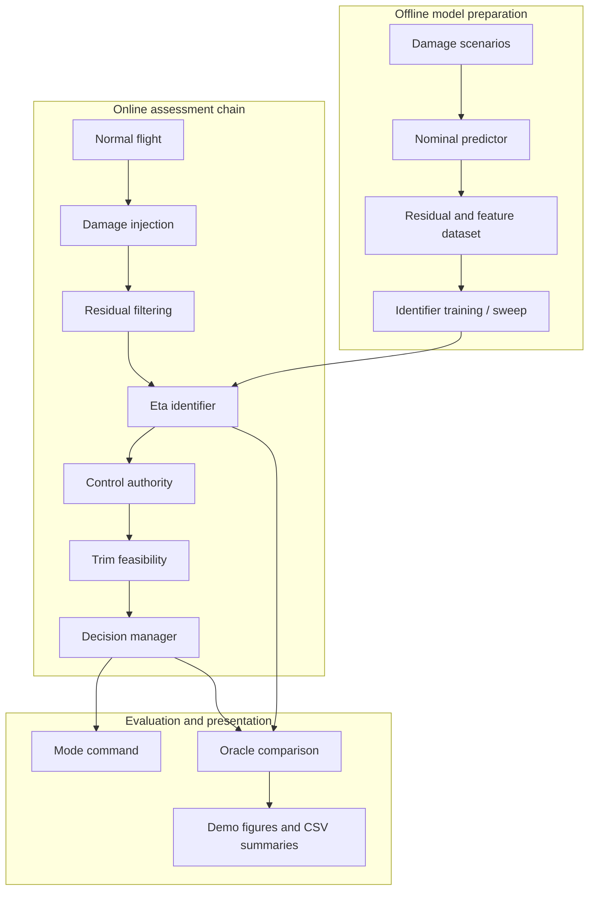

# Damaged Fixed-Wing Aircraft Online Identification and Decision System ✈️🔥🛠️

<p align="right">
  <a href="./README.md">English</a> | 
  <a href="./README.zh-CN.md">简体中文</a> | 
  <a href="./README.fr.md">Français</a>
</p>

<p align="center">
  
  
  
</p>

> A MATLAB/Simulink research prototype for answering one slightly dramatic but very practical question:
>
> **"The aircraft is damaged. Can it still behave, and if not, how nervous should we be?"** 😅

## Abstract

This repository presents a staged prototype for **online damage identification, controllability assessment, trim feasibility analysis, and mission decision support** for damaged fixed-wing aircraft. The project combines MATLAB scripts, Simulink models, residual-driven identification logic, and closed-loop evaluation tools into one research workflow.

In plain language:  
the aircraft gets hurt, the model tries not to panic, the identifier plays detective, and the decision logic decides whether everybody should stay calm, head home, divert, or start having very serious conversations with gravity 🌶️

The current project baseline covers:

- damage parameterization and aerodynamic/control-effect mapping
- nominal prediction and sensor residual generation
- filtered residual based identification
- controllability and trim evaluation
- confidence-aware mission decision logic
- benchmark, error breakdown, sensitivity, and closed-loop consistency analysis
- Simulink-side prototype interface and visualization support

## Quick Navigation

- [Quick Start](#quick-start)
- [System Overview](#2-system-overview)
- [Method](#5-method)
- [Data and Artifacts](#6-data-and-artifacts)
- [Recommended Workflow](#8-recommended-workflow)
- [Key Scripts](#9-key-scripts)
- [Further Reading](#13-further-reading)

---

## Quick Start

Three lines to reproduce the demo from a clean checkout, run from the
repository root in MATLAB R2023a or later (Simulink + Aerospace Blockset
required for the model itself, but the analysis scripts run without them):

```matlab
openProject('DamagedAircraftOnlineIDDecision.prj')   % attaches paths
run('scripts/init_project.m')                        % loads P, theta_d, g0
run_demo_scenario                                    % MildWing / CompoundDivert / SevereEgress
```

If `data/identifier_dataset_v3.mat` is missing (it is no longer tracked in
git), the entry scripts call `generate_identifier_dataset` automatically
before evaluation. To regenerate everything from scratch:

```matlab
generate_identifier_dataset    % rebuilds data/identifier_dataset_v3.mat
run_identifier_hyperparam_sweep
run_identifier_closed_loop_batch
evaluate_decision_consistency
```

---

## 1. Introduction

Aircraft damage assessment is a classic "everything is fine until suddenly it is very much not" problem 💀  
The purpose of this project is to build a runnable engineering prototype that connects:

1. **damage representation**
2. **online identification**
3. **control authority evaluation**
4. **decision support**

so that the full chain can be studied in one place instead of scattering logic across scripts, notebooks, screenshots, and the ancient engineering ritual known as "it should probably work."

---

## 2. System Overview

### 2.1 Functional Goal

The project tries to answer four questions:

- **What is damaged?**
- **How much controllability is left?**
- **Can the aircraft still trim and remain mission-capable?**
- **What should the mission logic do next?**

### 2.2 End-to-End Pipeline



### 2.3 One-Line Summary

```text
damage -> residuals -> features -> identifier -> controllability -> trim -> decision
```

This is the main plot. Everything else is supporting cast, analysis tooling, or MATLAB doing deeply MATLAB things.

---

## 3. Main Contributions

### 3.1 P1: Damage Assessment Core

- structured `12 x 1` damage vector `theta_d`
- mapping from structural / actuator damage to aero-control effects
- controllability metrics `eta_roll`, `eta_pitch`, `eta_yaw`, `eta_total`
- rule-based trim feasibility analysis
- initial mission decision logic

### 3.2 P2: Residual-Driven Identification Prototype

- identification dataset generation
- baseline identifier training and evaluation
- identified-vs-oracle closed-loop comparison

### 3.3 P3 / P3.5: Stronger Research Pipeline

- nominal response prediction
- residual filtering
- richer feature engineering
- multiple model configurations
- confidence and uncertainty proxy outputs
- decision robustness analysis
- error breakdown and hyperparameter sweep

### 3.4 P4-lite: Visualization / Presentation Layer

- visualization interface in the model
- demo figure export
- architecture / program flow / presentation diagrams
- model snapshot export for reports or slides

Short version: it went from "can we estimate something?" to  
"can we estimate something useful, evaluate it, explain it, and survive the presentation Q&A?" 📊🙂

---

## 4. Damage Representation

The damage state is represented by a continuous vector:

```text
theta_d in R^(12 x 1), each element typically in [0, 1]
```

| Index | Variable | Meaning |
| --- | --- | --- |
| 1 | `left_inner_wing` | left inner wing structural damage |
| 2 | `left_outer_wing` | left outer wing structural damage |
| 3 | `right_inner_wing` | right inner wing structural damage |
| 4 | `right_outer_wing` | right outer wing structural damage |
| 5 | `left_horizontal_tail` | left horizontal tail damage |
| 6 | `right_horizontal_tail` | right horizontal tail damage |
| 7 | `vertical_tail` | vertical tail damage |
| 8 | `left_aileron_eff` | left aileron effectiveness loss |
| 9 | `right_aileron_eff` | right aileron effectiveness loss |
| 10 | `elevator_eff` | elevator effectiveness loss |
| 11 | `rudder_eff` | rudder effectiveness loss |
| 12 | `thrust_eff` | thrust effectiveness loss |

This vector is the source of all drama in the simulation, which is very efficient because it keeps the drama numerically indexed.

---

## 5. Method

### 5.1 Nominal Prediction

The project uses a simplified nominal predictor to estimate what the aircraft **should** do if it were healthy-ish:

- `functions/dynamics/predict_nominal_response.m`

This is not a full optimal observer.  
It is more like:

> "Dear aircraft, under normal conditions you were supposed to do *this*. Why are you doing *that*?" 🤨

### 5.2 Residual Generation and Filtering

Residuals are generated by:

- `functions/dynamics/compute_sensor_residuals.m`

Residual filtering is handled by:

- `functions/dynamics/filter_residual_sequence.m`

Current residual channels include:

- velocity residual
- angular-rate residual
- attitude residual
- acceleration residual
- control-tracking residual

### 5.3 Feature Engineering

Feature construction entry:

- `functions/identifier/build_identifier_features.m`

Representative modes include:

- `summary`
- `summary_plus_residual_energy`
- `summary_plus_cross_channel_stats`
- `normalized_summary`
- `residual_coupling_summary`
- `sequence`
- `hybrid_sequence_summary`
- `hybrid_sequence_summary_v2`

### 5.4 Identification

Main training and inference functions:

- `functions/identifier/get_identifier_model_config.m`
- `functions/identifier/train_damage_identifier.m`
- `functions/identifier/run_damage_identifier.m`

Supported model families currently include:

- `ridge`
- `shallow_mlp`
- `ensemble_summary`
- `sequence_placeholder`

The default identification target is usually:

```text
eta_hat = [eta_roll_hat, eta_pitch_hat, eta_yaw_hat, eta_total_hat]
```

### 5.5 Assessment and Decision

Core evaluation chain:

- `functions/decision/compute_control_authority_metrics.m`
- `functions/decision/evaluate_trim_feasibility.m`
- `functions/decision/decision_manager.m`

Decision modes:

- `NORMAL`
- `STABILIZE`
- `RETURN`
- `DIVERT`
- `EGRESS_PREP`
- `UNRECOVERABLE`

This is the part where the repository stops being a regression problem and starts making life choices.

---

## 6. Data and Artifacts

### 6.1 Data Folder

The `data/` folder stores generated research datasets, including:

- `data/damage_dataset.mat`
- `data/identifier_dataset.mat`
- `data/identifier_dataset_v3.mat`

Typical dataset content includes:

- damage vector labels
- eta targets
- time histories
- state and input histories
- nominal prediction histories
- residual histories
- filtered residual histories
- prebuilt features
- scenario metadata
- split tags for train / validation / test

### 6.2 Results Folder

The `results/` folder contains:

- evaluation `.mat` files
- CSV summaries
- benchmark comparisons
- decision consistency reports
- error breakdown outputs
- sensitivity study outputs
- exported figures for reports / presentations

Examples:

- `results/identifier_eval_summary.csv`
- `results/identifier_benchmark_summary.csv`
- `results/decision_consistency_summary.csv`
- `results/error_breakdown_summary.csv`
- `results/decision_sensitivity_summary.csv`

### 6.3 Visual Outputs

Typical figure folders include:

- `results/figures_identifier/`
- `results/figures_identifier_benchmark/`
- `results/figures_decision_consistency/`
- `results/figures_error_breakdown/`
- `results/figures_decision_sensitivity/`
- `results/demo_figures/`

In research terms: reproducible artifacts.  
In human terms: pretty pictures proving the code did not simply free-associate under pressure. ✅

### 6.4 Current Demo Snapshot

The demo timeline is now explicit:

```text
0-3 s normal flight -> 3-4 s damage ramp -> 5 s assessment / decision
```

The 2026-04-26 run uses NED position integration and bounded predictor states, so the trajectory stays in physical scale instead of exploding into numerical theater.

| Scenario | Decision | `eta_total` | Confidence | Oracle match |
| --- | --- | ---: | ---: | ---: |
| `MildWingReturn` | `RETURN` | 0.985 | 0.769 | yes |
| `CompoundDivert` | `DIVERT` | 0.622 | 0.433 | yes |
| `SevereEgress` | `UNRECOVERABLE` | 0.389 | 0.352 | yes |

### 6.5 Demo Figures and P3.5 Summary

| Scenario | Trajectory | Assessment |
| --- | --- | --- |
| `MildWingReturn` |  |  |
| `CompoundDivert` |  |  |
| `SevereEgress` |  |  |

| Metric | Value |
| --- | ---: |
| Best sweep configuration | `ridge + normalized_summary + moving_average` |
| `eta_total` test MAE / RMSE | 0.0247 / 0.0377 |
| Closed-loop decision match rate | 100% |
| Unsafe undertrigger / dangerous mismatch | 0 / 0 |

Supplementary plots remain in `results/figures/`; architecture and flow diagrams are in `docs/system_architecture.md` and `docs/program_flow.md`.

---

## 7. Repository Structure

- `models/`  
  Main Simulink model and subsystem interfaces.

- `functions/`  
  Library functions, organized by responsibility:
  - `functions/utils/` — small reusable helpers (`clamp`, `save_figure`,
    `get_project_params`, `project_root`, `denormalize_targets`,
    `scenario_damage_severity`).
  - `functions/dynamics/` — physics layer: `predict_nominal_response`,
    `compute_sensor_residuals`, `filter_residual_sequence`,
    `parse_damage_vector`, `map_damage_to_aero_effects`,
    `damage_injection_interface`, `build_flight_condition`.
  - `functions/identifier/` — feature construction, training, and inference:
    `build_identifier_features`, `train_damage_identifier`,
    `run_damage_identifier`, `simulate_identifier_timeseries`,
    `get_identifier_model_config`, `get_identifier_target_config`.
  - `functions/decision/` — controllability metrics, trim feasibility,
    decision manager, online assessment pipeline.
  - `functions/simulink_bridges/` — interpreted-MATLAB-Function callables
    wired into the Simulink model (`damage_output_vector`,
    `decision_command_vector`, `online_identifier_placeholder_vector`,
    `simple_aircraft_force_moment_model`, `visualization_mode_proxy`).
  - `functions/scenarios/` — scenario builders shared across scripts.

- `scripts/`  
  Pipeline entry points for data generation, training, evaluation, validation,
  visualization, diagram export, and (`build_main_model`) Simulink wiring.

- `data/`  
  Generated datasets used for prototype research. The `.mat` files in this
  folder are no longer tracked in git; rerun `generate_identifier_dataset`
  to materialize them locally.

- `results/`  
  Figures, benchmark outputs, summaries, and closed-loop evaluation artifacts.
  Most contents are regenerated by analysis scripts and ignored by git;
  `results/demo_figures/` is the curated set the README embeds.

- `docs/`  
  Longer-form documentation and diagram markdown sources.

---

## 8. Recommended Workflow

### 8.1 Basic Research Flow

Run from the repository root (the directory containing this README):

```matlab
openProject('DamagedAircraftOnlineIDDecision.prj')   % or: cd to repo root and run init_project
run('scripts/init_project.m')
generate_identifier_dataset
benchmark_identifier_models
evaluate_identifier
run_identifier_closed_loop_batch
evaluate_decision_consistency
open_system('models/main_damaged_aircraft.slx')
```

### 8.2 Extended P3.5 Flow

```matlab
openProject('DamagedAircraftOnlineIDDecision.prj')
run('scripts/init_project.m')
generate_identifier_dataset
run_identifier_hyperparam_sweep
analyze_identifier_error_breakdown
analyze_decision_sensitivity
run_identifier_closed_loop_batch
evaluate_decision_consistency
validate_p35_pipeline
```

### 8.3 Presentation / Demo Flow

```matlab
run_demo_scenario
export_demo_figures
generate_architecture_diagrams
generate_presentation_diagrams
export_model_snapshots
```

---

## 9. Key Scripts

### 9.1 Identification and Evaluation

- `scripts/generate_identifier_dataset.m`
- `scripts/benchmark_identifier_models.m`
- `scripts/evaluate_identifier.m`
- `scripts/run_identifier_hyperparam_sweep.m`
- `scripts/analyze_identifier_error_breakdown.m`

### 9.2 Closed-Loop Decision Analysis

- `scripts/run_identifier_closed_loop_batch.m`
- `scripts/evaluate_decision_consistency.m`
- `scripts/analyze_decision_sensitivity.m`
- `scripts/validate_p35_pipeline.m`

### 9.3 Visualization and Presentation

- `scripts/check_visualization_toolchain.m`
- `scripts/run_demo_scenario.m`
- `scripts/visualize_flight_scenario.m`
- `scripts/export_demo_figures.m`
- `scripts/export_model_snapshots.m`
- `scripts/generate_architecture_diagrams.m`
- `scripts/generate_presentation_diagrams.m`

---

## 10. Simulink Integration

Main model:

- `models/main_damaged_aircraft.slx`

Important subsystems / interfaces include:

- `Online Damage Identifier`
- `Visualization Interface`

Current deployment status:

- online inference path is still prototype-grade
- some interfaces still use placeholder logic
- the project is designed so the identifier backend can be replaced later with stronger learned models

Translation:

> the plumbing is real, the intelligence is improving, and the final boss is still "deploy the actual model cleanly in Simulink without summoning three new interface bugs" 😤

---

## 11. Known Limitations

- the nominal predictor is still engineering-style, not a strict observer
- uncertainty is a proxy, not a calibrated probability
- sequence models are still placeholder-level
- some decision guards are engineering heuristics
- several result files are generated artifacts rather than minimal source-only assets

So yes, this is a research prototype.  
No, it is not pretending to be a certified flight computer with feelings of grandeur. We stay humble here 🙏

---

## 12. Project Mood Board

- MATLAB: "I can do that."
- Simulink: "I can also do that, but visually."
- Damage identifier: "I think something is wrong."
- Decision manager: "Define wrong."
- Researcher at 2 a.m.: "Why is `eta_total` emotionally unstable again?" ☕
- Reviewer: "Interesting. How robust is it?"
- Researcher, opening `results/`: "Funny you should ask." 😌

---

## 13. Further Reading

- Detailed technical notes: [docs/README.md](./docs/README.md)
- Architecture notes: [docs/system_architecture.md](./docs/system_architecture.md)
- Program flow: [docs/program_flow.md](./docs/program_flow.md)
- Presentation flow: [docs/presentation_flow.md](./docs/presentation_flow.md)

---

## 14. Closing Remark

If a normal repository says:

> "here is my code"

this repository says:

> "here is the code, the data, the figures, the pipeline, the decisions, the consequences, and a tasteful amount of aerospace-flavored existentialism" 🚀
