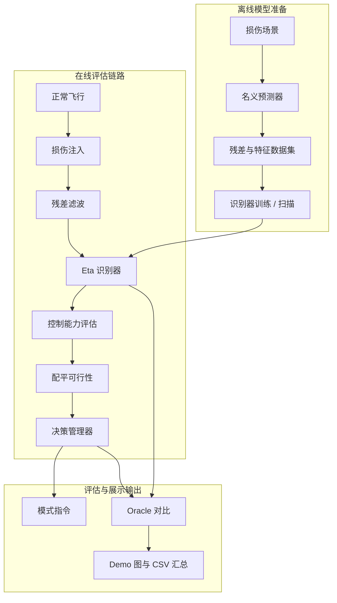
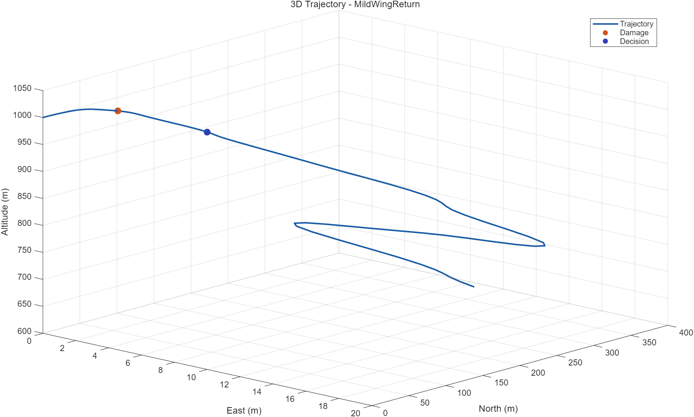
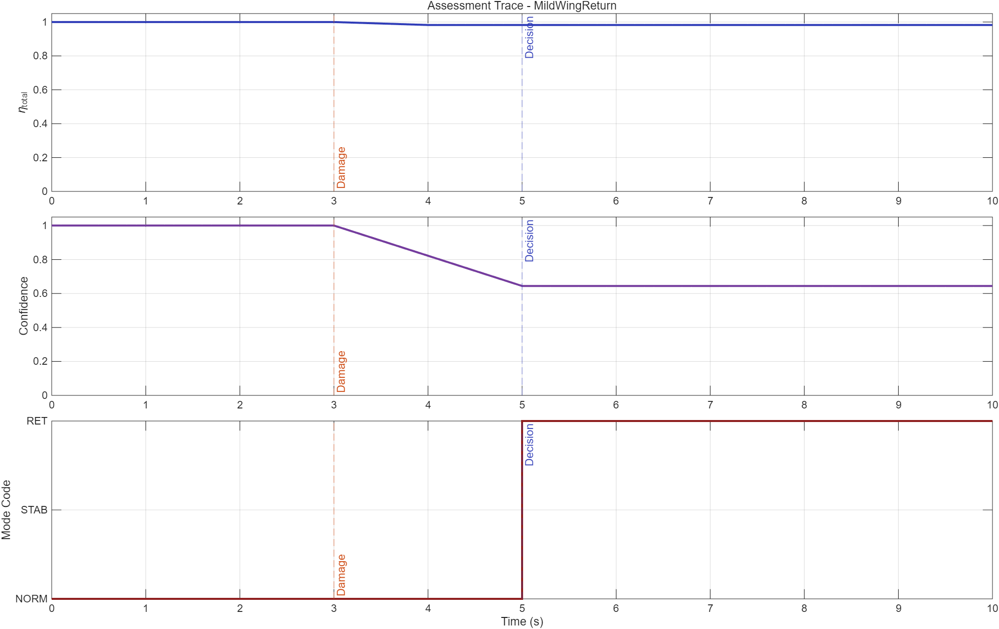
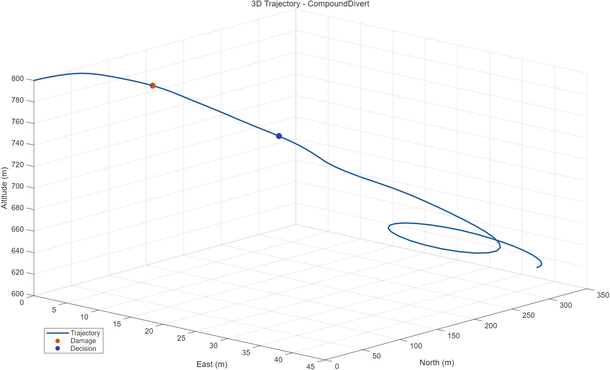
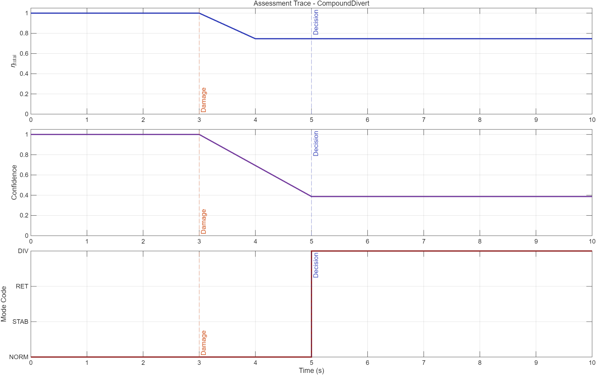
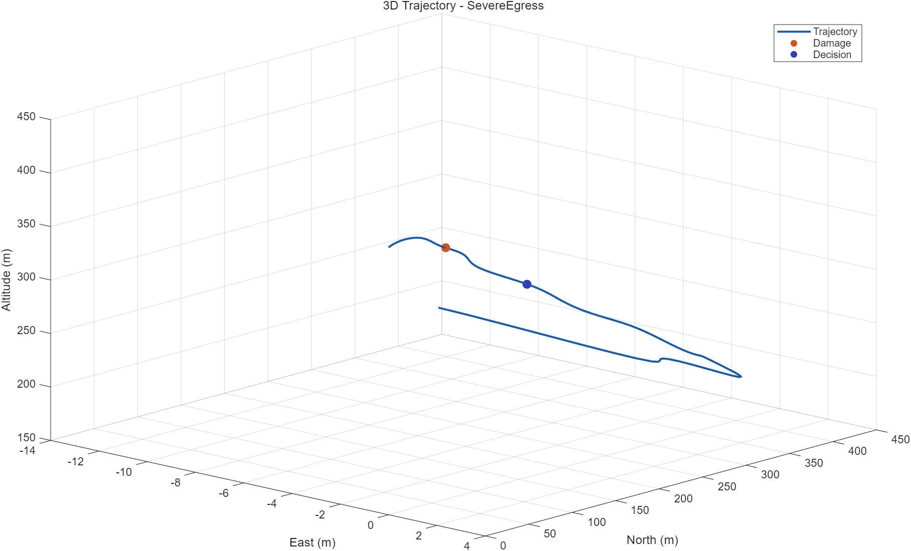
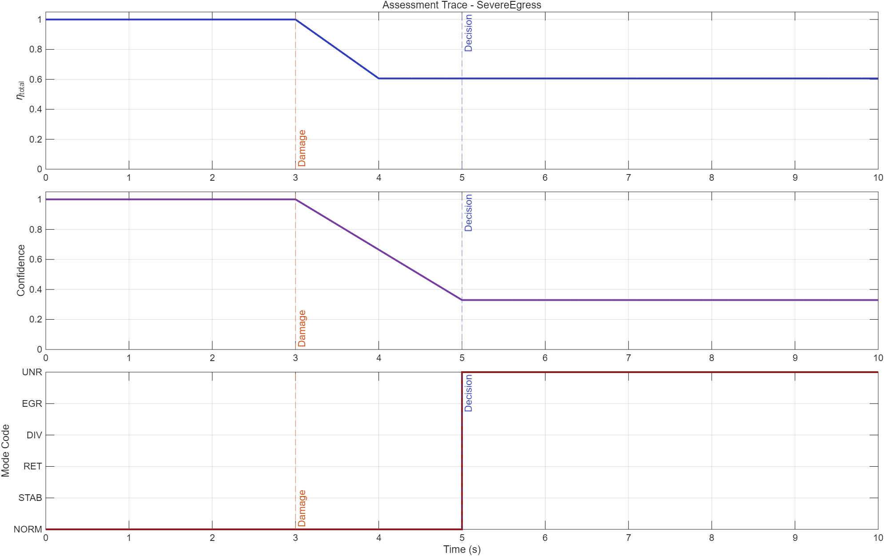

# 受损固定翼飞行器在线识别与任务决策系统 ✈️🔥🛠️

<p align="right">
  <a href="./README.md">English</a> | 
  <a href="./README.zh-CN.md">简体中文</a> | 
  <a href="./README.fr.md">Français</a>
</p>

<p align="center">
  
  
  
</p>

> 一个略带戏剧性、但确实很实际的 MATLAB/Simulink 原型项目：
>
> **“飞机受损了。它还能不能正常飞？如果不能，我们到底该多慌？”** 😅

## 摘要

本仓库围绕**受损固定翼飞行器的在线损伤识别、可控性评估、配平可行性分析与任务决策支持**构建了一套分阶段研究原型。项目将 MATLAB 脚本、Simulink 模型、残差驱动识别逻辑和闭环评估工具串成一条完整流程。

说人话就是：  
飞机受伤，模型先别慌；识别器开始办案；决策逻辑再判断是继续稳住、返航、备降，还是该认真思考一下地心引力的问题了 🌶️

当前仓库的主线能力包括：

- 损伤参数化与气动/控制效能映射
- 名义预测与传感器残差生成
- 基于滤波残差的在线识别
- 可控性与配平能力评估
- 带置信度保护的任务决策逻辑
- benchmark、误差分解、敏感性和闭环一致性分析
- Simulink 侧的在线接口与可视化支持

## 快速导航

- [快速上手](#快速上手)
- [系统总览](#2-系统总览)
- [方法](#5-方法)
- [数据与结果](#6-数据与结果)
- [推荐使用流程](#8-推荐使用流程)
- [关键脚本](#9-关键脚本)
- [延伸阅读](#13-延伸阅读)

---

## 快速上手

在仓库根目录(本 README 所在目录),用 MATLAB R2023a 或更新版本三行复现 demo
(完整模型需要 Simulink + Aerospace Blockset,纯分析脚本不需要):

```matlab
openProject('DamagedAircraftOnlineIDDecision.prj')   % 注册路径
run('scripts/init_project.m')                        % 装载 P, theta_d, g0
run_demo_scenario                                    % MildWing / CompoundDivert / SevereEgress
```

`data/identifier_dataset_v3.mat` 不再随 git 跟踪,缺失时入口脚本会自动调用
`generate_identifier_dataset` 生成。需要从零完整重跑:

```matlab
generate_identifier_dataset    % 重新生成 data/identifier_dataset_v3.mat
run_identifier_hyperparam_sweep
run_identifier_closed_loop_batch
evaluate_decision_consistency
```

---

## 1. 研究背景

飞行器损伤评估是一个典型的“前一秒还好好的，后一秒突然就不太妙了”的问题 💀  
这个项目的目标，是把下面四件事串到一个可运行原型里：

1. **损伤表达**
2. **在线识别**
3. **控制能力评估**
4. **任务决策支持**

这样就不用把逻辑分散在脚本、笔记、截图和“理论上应该能跑”的工程信仰里。

---

## 2. 系统总览

### 2.1 功能目标

本项目试图回答四个问题：

- **哪里坏了？**
- **还剩多少可控性？**
- **还能不能配平、还能不能继续完成任务？**
- **接下来该采取什么策略？**

### 2.2 端到端流程



### 2.3 一句话总结

```text
损伤 -> 残差 -> 特征 -> 识别 -> 可控性 -> 配平 -> 决策
```

这就是主剧情。其他部分要么是配角，要么是分析工具，要么是 MATLAB 在发挥它一贯的个性。

---

## 3. 项目阶段贡献

### 3.1 P1：损伤评估基础链路

- 结构化 `12 x 1` 损伤向量 `theta_d`
- 从结构/舵面损伤到气动控制效能的映射
- 可控性指标 `eta_roll`、`eta_pitch`、`eta_yaw`、`eta_total`
- 规则式配平可行性判断
- 初版任务决策逻辑

### 3.2 P2：残差驱动识别原型

- 识别数据集生成
- 基线识别器训练与评估
- identified-vs-oracle 闭环比较

### 3.3 P3 / P3.5：更完整的研究流水线

- 名义响应预测
- 残差滤波
- 更强的特征工程
- 多模型训练配置
- 置信度与不确定性代理输出
- 决策鲁棒性分析
- 误差分解与超参数扫描

### 3.4 P4-lite：展示与可视化层

- 模型内可视化接口
- demo 图导出
- 架构图 / 程序流图 / 汇报图
- 模型快照导出

简短版本就是：它已经从“能不能估点东西出来”进化到  
“能不能估得更靠谱、评得更完整、讲得更清楚，还能撑住答辩提问” 📊🙂

---

## 4. 损伤表示

损伤状态使用连续向量表示：

```text
theta_d in R^(12 x 1)，每个分量通常取值在 [0, 1]
```

| 索引 | 变量名 | 含义 |
| --- | --- | --- |
| 1 | `left_inner_wing` | 左内翼结构损伤 |
| 2 | `left_outer_wing` | 左外翼结构损伤 |
| 3 | `right_inner_wing` | 右内翼结构损伤 |
| 4 | `right_outer_wing` | 右外翼结构损伤 |
| 5 | `left_horizontal_tail` | 左平尾损伤 |
| 6 | `right_horizontal_tail` | 右平尾损伤 |
| 7 | `vertical_tail` | 垂尾损伤 |
| 8 | `left_aileron_eff` | 左副翼效能损失 |
| 9 | `right_aileron_eff` | 右副翼效能损失 |
| 10 | `elevator_eff` | 升降舵效能损失 |
| 11 | `rudder_eff` | 方向舵效能损失 |
| 12 | `thrust_eff` | 推力效能损失 |

这 12 个数值就是整个仿真世界里所有剧情冲突的来源，而且优点是冲突还可以编号。

---

## 5. 方法

### 5.1 名义预测

项目使用一个简化名义预测器来估计飞行器在“相对健康”情况下本来应该怎么飞：

- `functions/dynamics/predict_nominal_response.m`

它不是严格意义上的最优观测器。  
它更像是在问：

> “飞机同志,你正常情况下应该这样飞。你现在为什么突然有自己的想法了？” 🤨

### 5.2 残差生成与滤波

残差生成函数：

- `functions/dynamics/compute_sensor_residuals.m`

残差滤波函数：

- `functions/dynamics/filter_residual_sequence.m`

当前残差通道包括：

- 速度残差
- 角速度残差
- 姿态残差
- 加速度残差
- 控制跟踪残差

### 5.3 特征工程

特征构造入口：

- `functions/identifier/build_identifier_features.m`

代表性的特征模式包括：

- `summary`
- `summary_plus_residual_energy`
- `summary_plus_cross_channel_stats`
- `normalized_summary`
- `residual_coupling_summary`
- `sequence`
- `hybrid_sequence_summary`
- `hybrid_sequence_summary_v2`

### 5.4 在线识别

核心训练与推理函数：

- `functions/identifier/get_identifier_model_config.m`
- `functions/identifier/train_damage_identifier.m`
- `functions/identifier/run_damage_identifier.m`

当前支持的模型类型包括：

- `ridge`
- `shallow_mlp`
- `ensemble_summary`
- `sequence_placeholder`

默认识别目标通常为：

```text
eta_hat = [eta_roll_hat, eta_pitch_hat, eta_yaw_hat, eta_total_hat]
```

### 5.5 评估与决策

核心评估链路：

- `functions/decision/compute_control_authority_metrics.m`
- `functions/decision/evaluate_trim_feasibility.m`
- `functions/decision/decision_manager.m`

决策模式包括：

- `NORMAL`
- `STABILIZE`
- `RETURN`
- `DIVERT`
- `EGRESS_PREP`
- `UNRECOVERABLE`

到这里，这个仓库就从“回归问题”正式升级成了“替飞行器做人生选择”。

---

## 6. 数据与结果

### 6.1 数据集

`data/` 目录中存放研究数据集，例如：

- `data/damage_dataset.mat`
- `data/identifier_dataset.mat`
- `data/identifier_dataset_v3.mat`

数据通常包含：

- 损伤标签
- eta 目标值
- 时间序列
- 状态与输入历史
- 名义预测历史
- 残差与滤波残差
- 预构建特征
- 场景元数据
- 训练/验证/测试划分标签

### 6.2 结果文件

`results/` 目录中包含：

- 评估 `.mat` 文件
- CSV 汇总表
- benchmark 对比结果
- 决策一致性分析
- 误差分解结果
- 敏感性分析结果
- 汇报图表导出

例如：

- `results/identifier_eval_summary.csv`
- `results/identifier_benchmark_summary.csv`
- `results/decision_consistency_summary.csv`
- `results/error_breakdown_summary.csv`
- `results/decision_sensitivity_summary.csv`

### 6.3 图表输出

常见图表目录包括：

- `results/figures_identifier/`
- `results/figures_identifier_benchmark/`
- `results/figures_decision_consistency/`
- `results/figures_error_breakdown/`
- `results/figures_decision_sensitivity/`
- `results/demo_figures/`

学术表述叫“可复现实验产物”。  
大白话叫“用来证明代码不是在关键时刻开始自由发挥的漂亮图片”。 ✅

### 6.4 当前 Demo 快照

当前 demo 时间线已经明确：

```text
0-3 s 正常飞行 -> 3-4 s 损伤爬升 -> 5 s 评估 / 决策
```

2026-04-26 的结果使用 NED 坐标位置积分和预测器限幅，轨迹保持在物理尺度内，不再出现数值发散。

| 场景 | 决策 | `eta_total` | 置信度 | Oracle 匹配 |
| --- | --- | ---: | ---: | ---: |
| `MildWingReturn` | `RETURN` | 0.985 | 0.769 | 是 |
| `CompoundDivert` | `DIVERT` | 0.622 | 0.433 | 是 |
| `SevereEgress` | `UNRECOVERABLE` | 0.389 | 0.352 | 是 |

### 6.5 Demo 图与 P3.5 汇总

| 场景 | 轨迹 | 评估 |
| --- | --- | --- |
| `MildWingReturn` |  |  |
| `CompoundDivert` |  |  |
| `SevereEgress` |  |  |

| 指标 | 数值 |
| --- | ---: |
| 最优扫描配置 | `ridge + normalized_summary + moving_average` |
| `eta_total` 测试 MAE / RMSE | 0.0247 / 0.0377 |
| 闭环决策模式匹配率 | 100% |
| 不安全低估 / 危险不匹配 | 0 / 0 |

补充统计图保留在 `results/figures/`；系统框图见 `docs/system_architecture.md` 和 `docs/program_flow.md`。

---

## 7. 仓库结构

- `models/`  
  Simulink 主模型及其接口子系统。

- `functions/`  
  按职责划分的库函数子目录:
  - `functions/utils/` — 通用小工具(`clamp`、`save_figure`、
    `get_project_params`、`project_root`、`denormalize_targets`、
    `scenario_damage_severity`)。
  - `functions/dynamics/` — 物理层:`predict_nominal_response`、
    `compute_sensor_residuals`、`filter_residual_sequence`、
    `parse_damage_vector`、`map_damage_to_aero_effects`、
    `damage_injection_interface`、`build_flight_condition`。
  - `functions/identifier/` — 特征构造、训练与推理:
    `build_identifier_features`、`train_damage_identifier`、
    `run_damage_identifier`、`simulate_identifier_timeseries`、
    `get_identifier_model_config`、`get_identifier_target_config`。
  - `functions/decision/` — 可控性指标、配平可行性、决策管理器、
    在线评估流水线。
  - `functions/simulink_bridges/` — Simulink Interpreted MATLAB Function
    桥接函数(`damage_output_vector`、`decision_command_vector`、
    `online_identifier_placeholder_vector`、
    `simple_aircraft_force_moment_model`、`visualization_mode_proxy`)。
  - `functions/scenarios/` — 跨脚本共享的场景构造函数。

- `scripts/`  
  数据生成、训练、评估、验证、可视化、图表导出的入口脚本,
  外加 `build_main_model`(Simulink 模型布线)。

- `data/`  
  研究用数据集。该目录下的 `.mat` 文件已不再随 git 跟踪,
  本地缺失时执行 `generate_identifier_dataset` 即可重建。

- `results/`  
  图表、benchmark 输出、汇总表和闭环评估产物。绝大部分内容由分析脚本
  自动生成,已被 git 忽略;`results/demo_figures/` 是 README 嵌入的
  精选 demo 图片,会随仓库一起跟踪。

- `docs/`  
  更详细的文档与流程图 Markdown 源文件。

---

## 8. 推荐使用流程

### 8.1 基础研究流程

从仓库根目录(本 README 所在目录)运行:

```matlab
openProject('DamagedAircraftOnlineIDDecision.prj')   % 或:cd 到仓库根目录后直接 run init_project
run('scripts/init_project.m')
generate_identifier_dataset
benchmark_identifier_models
evaluate_identifier
run_identifier_closed_loop_batch
evaluate_decision_consistency
open_system('models/main_damaged_aircraft.slx')
```

### 8.2 扩展 P3.5 流程

```matlab
openProject('DamagedAircraftOnlineIDDecision.prj')
run('scripts/init_project.m')
generate_identifier_dataset
run_identifier_hyperparam_sweep
analyze_identifier_error_breakdown
analyze_decision_sensitivity
run_identifier_closed_loop_batch
evaluate_decision_consistency
validate_p35_pipeline
```

### 8.3 展示 / Demo 流程

```matlab
run_demo_scenario
export_demo_figures
generate_architecture_diagrams
generate_presentation_diagrams
export_model_snapshots
```

---

## 9. 关键脚本

### 9.1 识别与评估

- `scripts/generate_identifier_dataset.m`
- `scripts/benchmark_identifier_models.m`
- `scripts/evaluate_identifier.m`
- `scripts/run_identifier_hyperparam_sweep.m`
- `scripts/analyze_identifier_error_breakdown.m`

### 9.2 闭环决策分析

- `scripts/run_identifier_closed_loop_batch.m`
- `scripts/evaluate_decision_consistency.m`
- `scripts/analyze_decision_sensitivity.m`
- `scripts/validate_p35_pipeline.m`

### 9.3 可视化与汇报

- `scripts/check_visualization_toolchain.m`
- `scripts/run_demo_scenario.m`
- `scripts/visualize_flight_scenario.m`
- `scripts/export_demo_figures.m`
- `scripts/export_model_snapshots.m`
- `scripts/generate_architecture_diagrams.m`
- `scripts/generate_presentation_diagrams.m`

---

## 10. Simulink 集成

主模型：

- `models/main_damaged_aircraft.slx`

重要子系统 / 接口包括：

- `Online Damage Identifier`
- `Visualization Interface`

当前部署状态：

- 在线推理路径仍属于 prototype 级别
- 部分接口仍使用占位逻辑
- 项目结构已经为后续替换更强识别模型预留了位置

翻译成大白话就是：

> 管线是真的，能力在变强，最终 Boss 仍然是“把真实模型干净地部署进 Simulink，而且别再顺手引入三个新接口 bug” 😤

---

## 11. 当前局限

- 名义预测器仍偏工程近似，而非严格观测器
- 不确定性是代理量，不是校准后的概率
- 时序模型仍然偏占位阶段
- 部分决策保护机制仍是工程启发式
- 部分结果文件属于生成产物，而不是最精简源码资产

所以，是的，这仍然是一个研究原型。  
不是，它并没有假装自己已经是带认证的飞控计算机。我们保持谦逊 🙏

---

## 12. 项目气质板

- MATLAB：“这个我能做。”
- Simulink：“这个我也能做，而且我还能画出来。”
- 损伤识别器：“我觉得哪里不对。”
- 决策管理器：“你先定义一下什么叫不对。”
- 深夜两点的研究者：“为什么 `eta_total` 今天情绪这么不稳定？” ☕
- 审稿人：“Interesting. How robust is it?”
- 研究者，一边打开 `results/`：“您这问题问得可太对了。” 😌

---

## 13. 延伸阅读

- 详细技术文档：[docs/README.md](./docs/README.md)
- 系统架构说明：[docs/system_architecture.md](./docs/system_architecture.md)
- 程序流程说明：[docs/program_flow.md](./docs/program_flow.md)
- 汇报流程说明：[docs/presentation_flow.md](./docs/presentation_flow.md)

---

## 14. 收尾发言

如果普通仓库会说：

> “这是我的代码。”

那这个仓库会说：

> “这是我的代码😊"