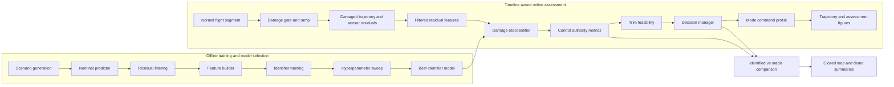
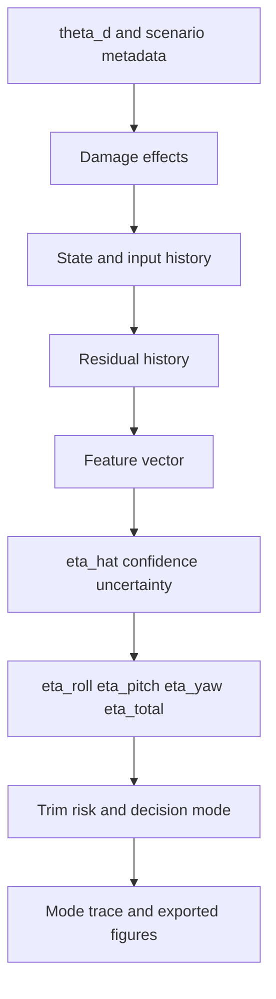

# System Architecture

## Current Block Diagram

The current demo chain is explicitly staged as normal flight, damage injection, identification and assessment, and decision-command execution. Offline training remains separated from the online assessment backbone so the identifier model can evolve without changing the control-authority, trim, and decision interfaces.

## Primary Runtime Signals

